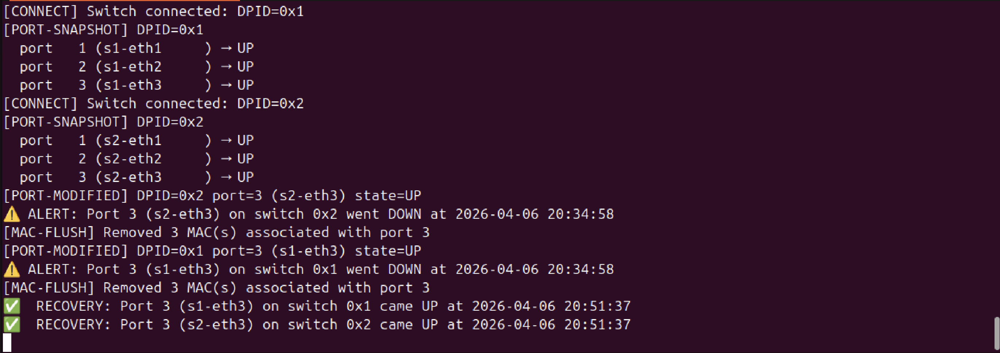
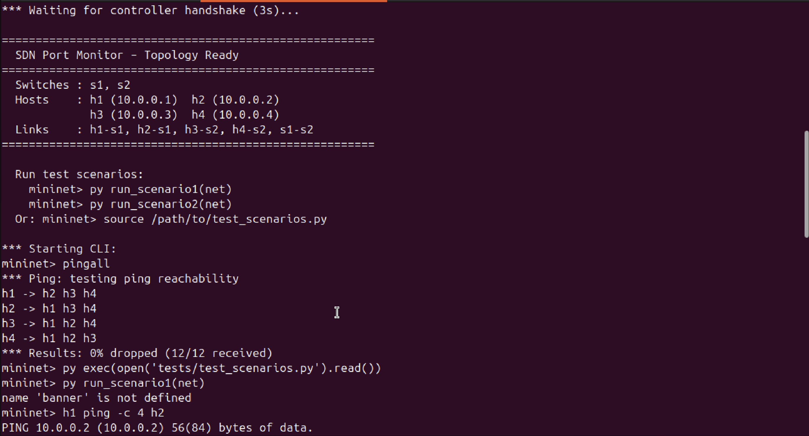
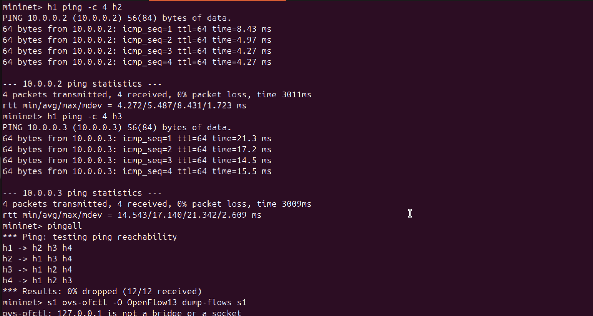
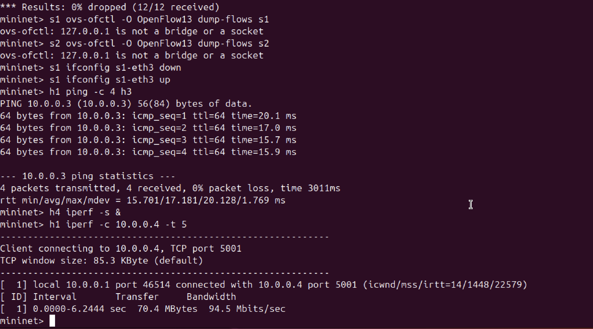
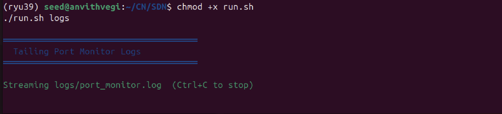

# SDN Port Monitor – Orange Problem
> **Course Assignment** | Mininet + Ryu OpenFlow Controller

## Problem Statement

This project implements an **SDN-based port status monitoring system** using Mininet and the Ryu OpenFlow controller. The controller monitors switch port status changes in real-time, detects port UP/DOWN events, logs all changes with timestamps, generates alerts on port failures, and displays live statistics.

**Key capabilities:**
- Controller–switch interaction via OpenFlow 1.3
- Packet-in handling with MAC learning (learning switch)
- Explicit flow rule installation (match + action)
- Port event detection and structured logging
- Alert generation on port failure/recovery
- Periodic port statistics polling (every 10 seconds)

---

## Architecture

```
┌─────────────┐        OpenFlow 1.3        ┌─────────┐   ┌─────────┐
│  Ryu        │◄──────────────────────────►│   s1    │───│   s2    │
│  Controller │   port_status / packet_in  └────┬────┘   └────┬────┘
│ port_monitor│                                h1,h2         h3,h4
└─────────────┘
       │
  logs/events.json
  logs/alerts.json
  logs/stats_*.json
```

**Topology:**
- 2 switches (s1, s2) connected via an inter-switch link
- 4 hosts: h1, h2 on s1 | h3, h4 on s2
- All links: TCLink with configurable bandwidth and delay

---

## ⚠️ Python Version Notice

**Ryu does NOT support Python 3.10+.** You must use **Python 3.9** via Miniconda.

---

## Setup

### Step 1 – System dependencies

```bash
sudo apt update
sudo apt install -y mininet openvswitch-switch
sudo systemctl start openvswitch-switch
```

### Step 2 – Miniconda (skip if already installed)

```bash
wget https://repo.anaconda.com/miniconda/Miniconda3-latest-Linux-x86_64.sh -O miniconda.sh
bash miniconda.sh -b -p $HOME/miniconda
echo 'export PATH="$HOME/miniconda/bin:$PATH"' >> ~/.bashrc
source ~/.bashrc
```

### Step 3 – Create Python 3.9 environment and install Ryu

```bash
conda create -n ryu-env python=3.9 -y
conda activate ryu-env
pip install ryu eventlet==0.30.2
```

Verify:
```bash
ryu-manager --version
```

### Step 4 – Clone the project

```bash
git clone https://github.com/<your-username>/sdn-port-monitor.git
cd sdn-port-monitor
chmod +x run.sh
```

---

## Running the Project

Open **3 terminals** in the project directory.

### Terminal 1 – Ryu Controller

```bash
conda activate ryu-env
ryu-manager --observe-links controller/port_monitor.py
```

Wait for: `loading app controller/port_monitor.py`

### Terminal 2 – Mininet Topology

```bash
sudo python3 topology/topology.py
```

Wait for the `mininet>` prompt. Terminal 1 should show `[CONNECT]` and `[PORT-SNAPSHOT]`.

### Terminal 3 – Live Logs (optional)

```bash
tail -f logs/port_monitor.log
```

---

## Running Test Scenarios

From the **Mininet CLI** (Terminal 2):

**Load the test functions:**
```
mininet> py exec(open('tests/test_scenarios.py').read(), globals())
```
> ⚠️ The `globals()` argument is required. Without it, functions are defined in a temporary scope and immediately lost.

**Scenario 1 – Normal connectivity:**
```
mininet> py run_scenario1(net)
```

**Scenario 2 – Port failure and recovery:**
```
mininet> py run_scenario2(net)
```

---

## Expected Output

### Scenario 1 – Normal Connectivity
```
[CONNECT]  Switch connected: DPID=0x1
[PORT-SNAPSHOT] DPID=0x1
  port   1 (s1-eth1     ) → UP
  port   2 (s1-eth2     ) → UP
  port   3 (s1-eth3     ) → UP
[LEARN]   DPID=0x1 MAC=00:00:00:00:00:01 → port 1
h1 → h3: 0% packet loss, rtt min/avg/max = 6/7/8 ms
```

### Scenario 2 – Port Failure
```
⚠️  ALERT: Port 3 (s1-eth3) on switch 0x1 went DOWN at 2024-11-15 10:32:01
[MAC-FLUSH] Removed 2 MAC(s) associated with port 3
...
✅  RECOVERY: Port 3 (s1-eth3) on switch 0x1 came UP at 2024-11-15 10:32:18
```

---

## Screenshots

| | |
|---|---|
|  |  |
|  |  |
|  | |

---

## Log Files

| File | Contents |
|------|----------|
| `logs/port_monitor.log` | Human-readable event stream |
| `logs/events.json` | All port events (newline-delimited JSON) |
| `logs/alerts.json` | Alerts only (PORT_DOWN / PORT_UP / SWITCH_DOWN) |
| `logs/stats_0x*.json` | Latest port statistics per switch |

---

## Flow Table Design

| Priority | Match | Action | Description |
|----------|-------|--------|-------------|
| 0 | (any) | → Controller | Table-miss: send unknown packets to controller |
| 1 | in_port + eth_src + eth_dst | → specific port | Learned forwarding rule |

Flow rules use `idle_timeout=30s` and `hard_timeout=120s` to remove stale entries automatically.

---

## Performance Observations

| Metric | Tool | Expected |
|--------|------|----------|
| Latency (same switch) | `ping` | ~1–2 ms |
| Latency (cross switch) | `ping` | ~6–10 ms |
| Throughput | `iperf` | ~90–950 Mbps (link limited) |
| Flow install delay | first ping RTT vs subsequent | visible RTT drop |
| Port-down detection | `EventOFPPortStatus` | < 1 second |

---

## Troubleshooting

**`ryu-manager: command not found`** → Run `conda activate ryu-env` first.

**`eventlet` / hub errors at startup** → Run `pip install eventlet==0.30.2` inside `ryu-env`.

**`run_scenario1 is not defined`** → You used `exec()` without `globals()`. Use:
```
mininet> py exec(open('tests/test_scenarios.py').read(), globals())
```

**Mininet cleanup after a crash:**
```bash
sudo mn -c
```

**OVS not running:**
```bash
sudo systemctl restart openvswitch-switch
```

---

## Project Structure

```
sdn-port-monitor/
├── controller/
│   └── port_monitor.py      # Ryu controller (main logic)
├── topology/
│   └── topology.py          # Mininet topology definition
├── tests/
│   └── test_scenarios.py    # Test scenario functions
├── screenshots/             # Demo screenshots
├── logs/                    # Auto-created at runtime
│   ├── port_monitor.log
│   ├── events.json
│   └── alerts.json
├── .gitignore
├── run.sh                   # Convenience launcher
└── README.md
```

---

## References

1. Ryu SDN Framework Documentation – https://ryu.readthedocs.io/
2. OpenFlow 1.3 Specification – https://opennetworking.org/wp-content/uploads/2014/10/openflow-spec-v1.3.0.pdf
3. Mininet Documentation – http://mininet.org/walkthrough/
4. Open vSwitch Documentation – https://docs.openvswitch.org/
5. Lantz, B. et al. "A Network in a Laptop: Rapid Prototyping for Software-Defined Networks." HotNets '10, 2010.
